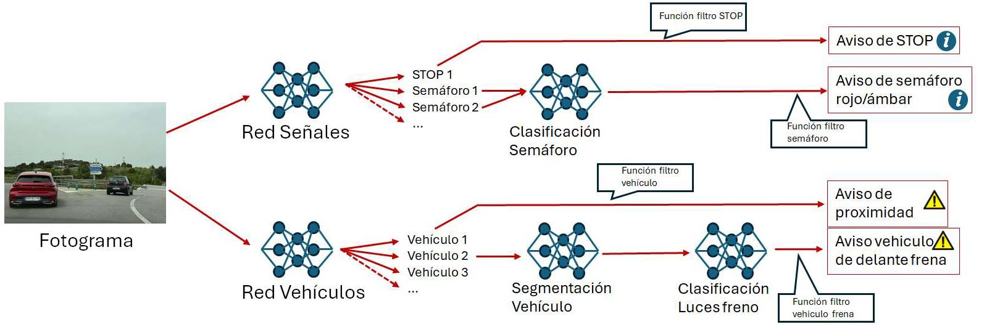
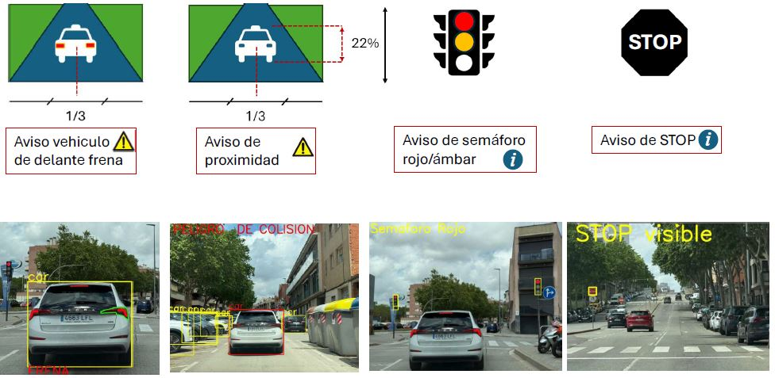
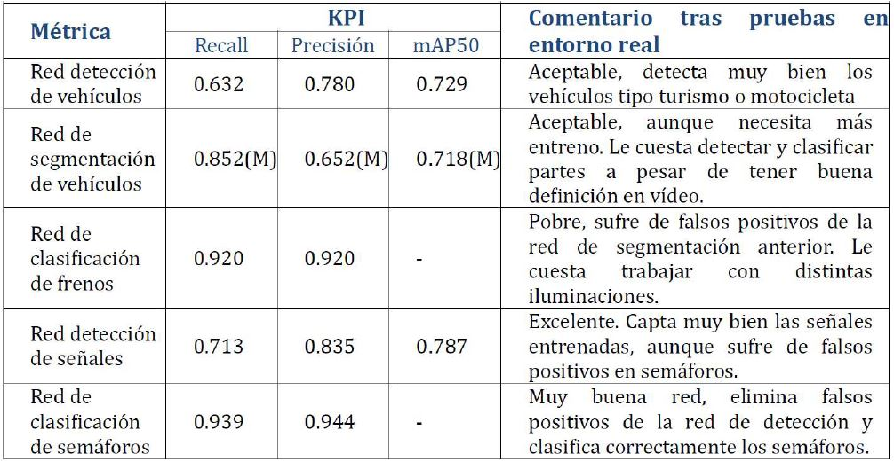

#	Application ADAS with deep learning

El proyecto tiene una licencia MIT License Open Source, en donde se proporciona el código en las versiones liberas y modificadas en el reportorio GIT, tal como está, en donde expresamente no existe responsabilidad por daños y perjuicios. Esta es una licencia de código abierto, que permite a cualquiera tener la libertad de usar el código y mejorarlo. 
El repositorio de código fuente se encuentra distribuido de la siguiente manera:
 	
* Models: Directorio donde se encuentran los modelos entrenados.
* Trainings: Directorio con notebooks donde se muestra cómo se entrenaron los modelos.
* main.ipynb: Archivo inicial de la aplicación. contiene dos modulos de trabajo: Imagen o vídeo.
* config.yaml: Archivo de configuración para main.
* resources: Directorio que contiene imágenes varias usadas para la elaboración de documentación.

# ADAS Applicación ayuda a la conducción con aprendizaje profundo

#	Descripción

Aplicación que usa 5 redes neuronales especializadas para realizar las siguientes funciones:

* Captar y procesar imágenes en tiempo real con buena visibilidad no nocturna
* Sistema compatible con cámaras estándar con resolución mínima de 1080p.
* Identificar y segmentar objetos clave: turismos, motocicletas, stops y semáforos.
* Emitir avisos visuales en función del análisis de la escena.
* Permitir ajustar los tipos de aviso: proximidad vehículo, stop, semáforo en rojo.

## Arquitectura:

El vídeo o captura de imágenes pasará a ser filtrado por una serie de redes neuronales que identificarán cada uno de los elementos e irán dando los avisos pertinentes:

## Redes neuronales:

- **Red se señales:** Red de detección CNN (YOLOv11) stops i semáforos. Emitirá una salida con una matriz de elementos identificados, con su posición y tamaño.
- **Red de vehículos:** Red de detección CNN (YOLOv11) coches y motos. Emitirá una salida con una matriz de elementos identificados, con su posición y tamaño.
- **Segmentación vehículo:** Red de segmentación CNN(YOLOv11-seg) para los coches. Red muy capaz de identificar cada uno de los elementos que conforman el vehículo, pero de la salida en forma de máscara, se guardará la de los pilotos traseros para evaluar el frenado.
- **Red luces de freno:** Red de clasificación binaria CNN(EfficientNet b0). La entrada será el piloto trasero de un vehículo y la respuesta será si frena o no (si están encendidas o no).
- **Red semáforo:** Red de clasificación de semáforo CNN(EfficientNet b0), cada una de sus tres posiciones.

## Filtros aviso:

## Resultados entrenamiento:

